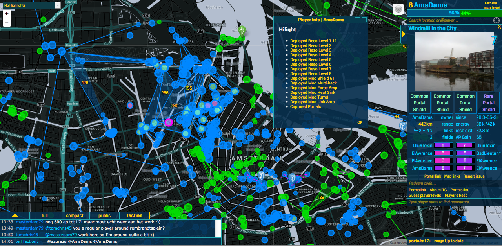

ingress iitc-plugins 
====================

player info 
------------

download &amp; install [IITC_plugin_player_info.user.js](./IITC_plugin_player_info.user.js "IITC_plugin_player_info.user.js") (click raw button).

this plugin will list resources deployed by player when clicked on playername. a dialoy will pop with clickable commands. resources like resonsators, mods, shields etc. see the screenshot of the dialog below.

coolclock 
------------

download &amp; install [IITC_plugin_coolclock.user.js](./IITC_plugin_coolclock.user.js "IITC_plugin_coolclock.user.js") (click raw button).

this plugin will display a clock with current time and date for current location on the map. a dialoy will pop with the ticking clock. see the screenshot of the dialog below.

