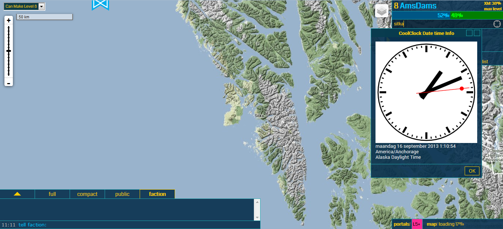
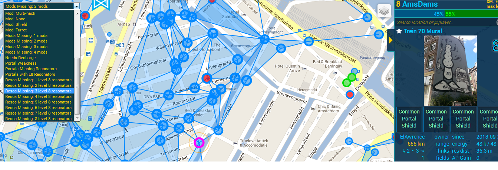
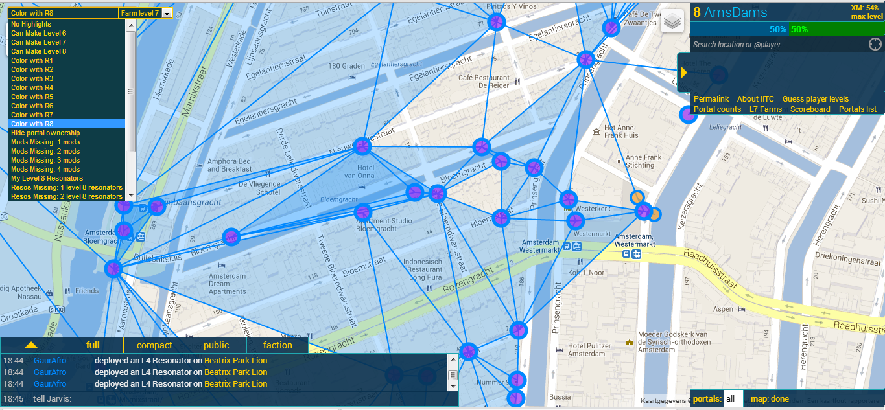
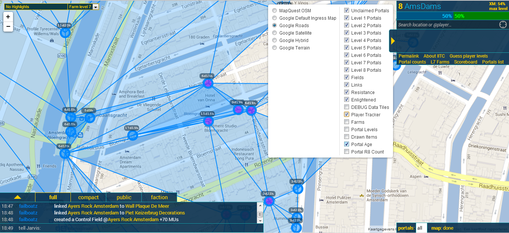
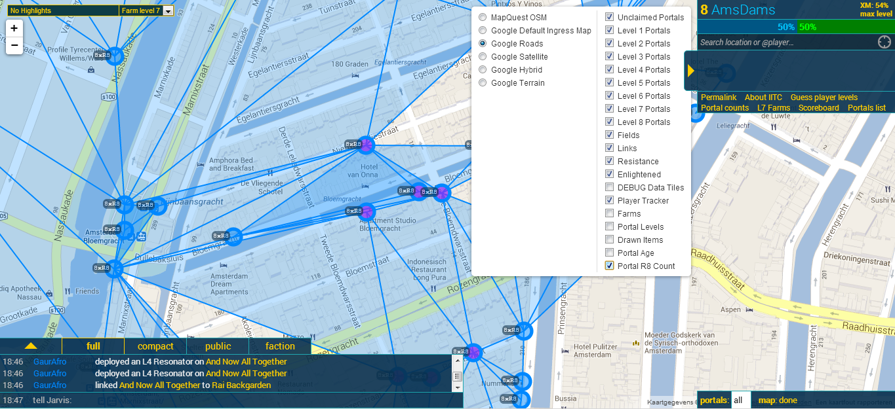

# coolclock.user.js

## description from JS:

	id: iitc-plugin-coolclock@amsdams

	name: IITC plugin: coolclock

	category: Highlighter

	version: 0.0.1.20130926.81348

	namespace: 	https://github.com/jonatkins/ingress-intel-total-conversion

	updateurl: https://raw.github.com/amsdams/iitc-plugins/master/coolclock.user.js

	dowloadurl: https://raw.github.com/amsdams/iitc-plugins/master/coolclock.user.js

	description: [local-2013-09-26-081348] displays ticking clock

	include: https://www.ingress.com/intel*

	include: http://www.ingress.com/intel*

	match: https://www.ingress.com/intel*

	match: http://www.ingress.com/intel*

	grant: none

## install link: [coolclock.user.js](./coolclock.user.js "coolclock.user.js ")

## preview image: 

# player-portals.user.js

## description from JS:

	id: iitc-plugin-player-portals@amsdams

	name: IITC plugin: player portals

	category: Info

	version: 0.1.1.20130926.81348

	namespace: 	https://github.com/jonatkins/ingress-intel-total-conversion

	updateurl: https://raw.github.com/amsdams/iitc-plugins/master/player-portals.user.js

	dowloadurl: https://raw.github.com/amsdams/iitc-plugins/master/player-portals.user.js

	description: [local-2013-09-26-081348] highlights portals with mods, resonators from player

	include: https://www.ingress.com/intel*

	include: http://www.ingress.com/intel*

	match: https://www.ingress.com/intel*

	match: http://www.ingress.com/intel*

	grant: none

## install link: [player-portals.user.js](./player-portals.user.js "player-portals.user.js ")

## preview image: 

# portal-highlighter-missing-mods.user.js

## description from JS:

	id: iitc-plugin-highlight-portals-missing-mods@amsdams

	name: IITC plugin: highlight portals missing mods

	category: Highlighter

	version: 0.1.2.20130926.81348

	namespace: 	https://github.com/jonatkins/ingress-intel-total-conversion

	updateurl: https://raw.github.com/amsdams/iitc-plugins/master/portal-highlighter-missing-mods.user.js

	dowloadurl: https://raw.github.com/amsdams/iitc-plugins/master/portal-highlighter-missing-mods.user.js

	description: [local-2013-09-26-081348] highlight portals missing mods

	include: https://www.ingress.com/intel*

	include: http://www.ingress.com/intel*

	match: https://www.ingress.com/intel*

	match: http://www.ingress.com/intel*

	grant: none

## install link: [portal-highlighter-missing-mods.user.js](./portal-highlighter-missing-mods.user.js "portal-highlighter-missing-mods.user.js ")

## preview image: 

# portal-highlighter-missing-resonators-level-8.user.js

## description from JS:

	id: iitc-plugin-highlight-portals-missing-resonators-level-8@amsdams

	name: IITC plugin: highlight portals missing resonators level 8

	category: Highlighter

	version: 0.1.3.20130927.121818

	namespace: 	https://github.com/jonatkins/ingress-intel-total-conversion

	updateurl: https://raw.github.com/amsdams/iitc-plugins/master/portal-highlighter-missing-resonators-level-8.user.js

	dowloadurl: https://raw.github.com/amsdams/iitc-plugins/master/portal-highlighter-missing-resonators-level-8.user.js

	description: [local-2013-09-27-121818] highlight portals missing level 8 resonators

	include: https://www.ingress.com/intel*

	include: http://www.ingress.com/intel*

	match: https://www.ingress.com/intel*

	match: http://www.ingress.com/intel*

	grant: none

## install link: [portal-highlighter-missing-resonators-level-8.user.js](./portal-highlighter-missing-resonators-level-8.user.js "portal-highlighter-missing-resonators-level-8.user.js ")

## preview image: 

# portal-highlighter-reso-count-color.user.js

## description from JS:

	id: iitc-plugin-highlight-portals-count-resonators-by-level@amsdams

	name: IITC plugin: highlight portals count resonators by level

	category: Highlighter

	version: 0.0.1.20131026.164441

	namespace: 	https://github.com/jonatkins/ingress-intel-total-conversion

	updateurl: https://raw.github.com/amsdams/iitc-plugins/master/portal-highlighter-reso-count-color.user.js

	dowloadurl: https://raw.github.com/amsdams/iitc-plugins/master/portal-highlighter-reso-count-color.user.js

	description: [local-2013-10-26-164441] highlight portals count level 8 resonators

	include: https://www.ingress.com/intel*

	include: http://www.ingress.com/intel*

	match: https://www.ingress.com/intel*

	match: http://www.ingress.com/intel*

	grant: none

## install link: [portal-highlighter-reso-count-color.user.js](./portal-highlighter-reso-count-color.user.js "portal-highlighter-reso-count-color.user.js ")

## preview image: 

# portal-layer-age.user.js

## description from JS:

	id: iitc-plugin-portal-layer-age@amsdams

	name: IITC plugin: Portal Layer Age

	category: Layer

	version: 0.0.1.20131026.164441

	namespace: 	https://github.com/jonatkins/ingress-intel-total-conversion

	updateurl: https://raw.github.com/amsdams/iitc-plugins/master/portal-layer-age.user.js

	dowloadurl: https://raw.github.com/amsdams/iitc-plugins/master/portal-layer-age.user.js

	description: [local-2013-10-26-164441] Show portal age in days.

	include: https://www.ingress.com/intel*

	include: http://www.ingress.com/intel*

	match: https://www.ingress.com/intel*

	match: http://www.ingress.com/intel*

	grant: none

## install link: [portal-layer-age.user.js](./portal-layer-age.user.js "portal-layer-age.user.js ")

## preview image: 

# portal-layer-r8-count.user.js

## description from JS:

	id: iitc-plugin-portal-layer-r8-count@amsdams

	name: IITC plugin: Portal Layer R8 Count

	category: Layer

	version: 0.0.1.20131026.164441

	namespace: 	https://github.com/jonatkins/ingress-intel-total-conversion

	updateurl: https://raw.github.com/amsdams/iitc-plugins/master/portal-layer-r8-count.user.js

	dowloadurl: https://raw.github.com/amsdams/iitc-plugins/master/portal-layer-r8-count.user.js

	description: [local-2013-10-26-164441] Show portal level 8 resonator count on map.

	include: https://www.ingress.com/intel*

	include: http://www.ingress.com/intel*

	match: https://www.ingress.com/intel*

	match: http://www.ingress.com/intel*

	grant: none

## install link: [portal-layer-r8-count.user.js](./portal-layer-r8-count.user.js "portal-layer-r8-count.user.js ")

## preview image: 

